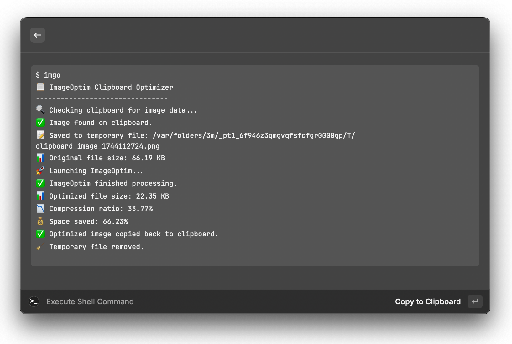

# A tool to compress image on clipboard

## Usage

1. Install [ImageOptim](https://imageoptim.com/mac) first
3. Copy an image to clipboard
4. Run the app
5. The image will be compressed and saved back to clipboard

## Run from Raycast

1. Rename `ClipboardImageOptimizer` to `imgo` and put it somewhere in the PATH
2. Run 'Execute Shell Command' in Raycast
3. Type `imgo` and run
4. The image will be compressed and saved back to clipboard

